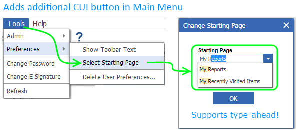
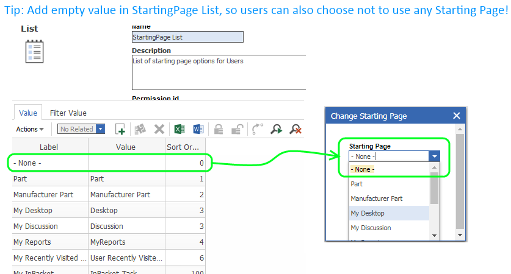

# Change Starting Page option for every user

## Description

This package adds an additional CUI Menu Button that give users the ability to choose the **Starting Page** by themselves.

In addition, this project can also be used as a simple and easy-to-follow example for the following use cases:
-	Create and use custom forms
-	Create CUI menu items
-	How to use drop-down lists independent from ItemTypes
-	:sparkles:**Learn how to handle type-ahead drop-down lists!**:sparkles:
-	Item queries and error handling 
-	…

## Project Details

#### Built Using:
Aras 11.0 SP11

#### Versions Tested:
Aras 11.0 SP11
The current release supports Aras versions >=11.0 SP11.
For older Aras versions (<= 11.0 SP10) you can use the available SP9 release.

#### Browsers Tested:
Internet Explorer 11, Chrome 66.0, Firefox ESR 52.7.4

## Installation

#### Important!
**Always back up your code tree and database before applying an import package or code tree patch!**

### Prerequisites

1. Aras Innovator installed (version 11.0 SPx preferred)
2. Aras Package Import tool
3. Import package of this project

### Install Steps

#### Database Installation
1. Backup your database and store the BAK file in a safe place.
2. Open up the Aras Package Import tool.
3. Enter your login credentials and click **Login**
    * _Note: You must login as root for the package import to succeed!_
4. Enter the package name in the TargetRelease field.
    * Optional: Enter a description in the Description field.
5. Enter the path to your local `..\cui-select-starting-page\Import\imports.mf` file in the Manifest File field.
6. Select **bpl.app.SelectStartingPage** in the Available for Import field.
7. Select Type = **Merge** and Mode = **Thorough Mode**.
8. Click **Import** in the top left corner.
9. Close the Aras Package Import tool.

## Usage

1. Login to Aras.
2. Navigate to **Tools > Preferences > Select Starting Page** in the main menu.
3. Choose the new Starting Page from the drop down list.
4. Click **Ok** to save the new Starting Page.

5. Optional: Add additional Starting Pages in **StartingPage List**

## Contributing

1. Fork it!
2. Create your feature branch: `git checkout -b my-new-feature`
3. Commit your changes: `git commit -am 'Add some feature'`
4. Push to the branch: `git push origin my-new-feature`
5. Submit a pull request

## Credits

Created by @AngelaIp
Contributions by:
@cgillis-aras

## License

This project is published to Github under the Microsoft Public License (MS-PL). See the [LICENSE file](./LICENSE.md) for license rights and limitations.